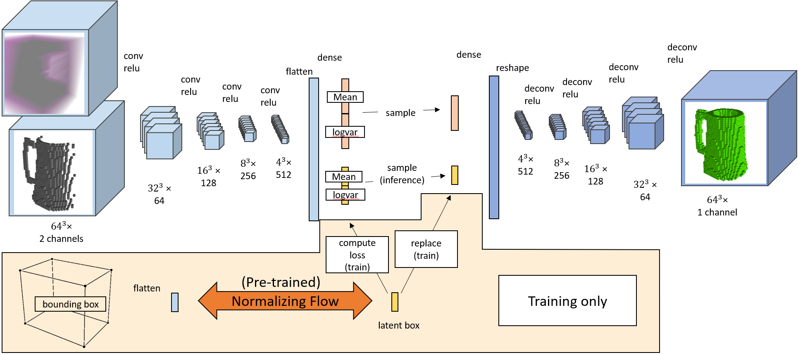

# Plausible Shape Sampling Network (PSSNet)
This ROS package implements PSSNet, a neural network that takes in a grid of visible occupied voxels from a single view and outputs a grid of the estimated 3D voxels, thus "completing the shape". Running multiple inference passes with the same input will generate different, yet plausible completions. Depending on the ambiguity of the input the completions may all be quite similar, or vary noticably.
For Details, see the paper: Diverse Plausible Shape Completions from Ambiguous Depth Images (link coming soon)

# Usage
To view completions of the test dataset.
1. `roslaunch shape_completion_visualization shape_completion.launch`
2. `cd shape_completion_visualization/scripts`, `./data_publisher.py --trial PSSNet/September_10_21-15-32_f87bdf38d4`

In RViz you can then cycle through the various shapes and increasing angles. Change the `--trial` arguments to explore the different networks and the YCB vs shapenet datasets.

# Installation
1. Install `ROS` [kinetic](http://wiki.ros.org/kinetic) or [melodic](http://wiki.ros.org/melodic)
2. Clone this package into your ros workspace
3. Clone the RViz plugins for [text seletion](https://github.com/bsaund/rviz_text_selection_panel) and [Voxelgrids](https://github.com/bsaund/rviz_voxelgrid_visuals) into your ros workspace
4. Install the python dependencies `pip install -r requirements.txt`. 
    1. install the [`CUDA`](https://developer.nvidia.com/cuda-toolkit) drivers necessary for tensorflow
    2. see below if there are issues with `python-pcl
5. Build and resource the catkin workspace
6. Download the pretrained model and preprocessed data: `./scripts/download_pretrained.py`

# Retraining networks and recomputing the plausible set
You do not have to use the pretrained models and preprocessed datasets. You can do all or any part of the following:
1. Download shapenet or ycb and run `augment_{shapenet, ycb}.py`
2. Compute the plausible set: `{shapenet, ycb}_plausibilities.py`
3. train a network `train.py --group {PSSNet, or other}`. If using PSSNet, first `train_flow.py`
4. evaluate a network compared to the plausible set. Edit and run `evaluate.py`

## Structure
 - `shape_completion_training`: Generating, training, evaluating the shape completion model and baselines
 - `shape_completion_visualization`: Scripts for viewing shape datasets and completions in RViz

## Troubleshooting

###The code is developed and tested on
- [`CUDA`](https://developer.nvidia.com/cuda-toolkit) 10.2 
- [`cuDNN`](https://developer.nvidia.com/rdp/cudnn-archive) 7.6
- [`Python`](https://www.python.org) 2.7.12 and 3.8.5
- [`TensorFlow`](https://github.com/tensorflow/tensorflow) 2.1
- `ROS` [kinetic](http://wiki.ros.org/kinetic) or [melodic](http://wiki.ros.org/melodic)
- For visualization in RViz: https://github.com/bsaund/rviz_text_selection_panel and https://github.com/bsaund/rviz_voxelgrid_visuals

### Installing python-pcl
The pcl version you need to install depends on OS and python version
Python 2, Ubuntu 18.04: `pip install python-pcl` I have sometimes found issues depending on `pcl` verion. see: https://github.com/strawlab/python-pcl/issues/317
Python 3, Ubuntu 20.04: `sudo apt install python3-pcl`
